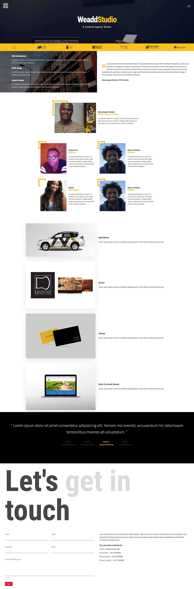

# WDD
An HTML/CSS Responsive Webpage for an Agency studio.
## Get started
1. Install dependencies

```npm i```

2. Start server

```npm start```

This command will run `live-server` to start a server, you need to install it with `npm i -g live-server`
You should be able to make changes after this.

## Preview
### Desktop

### Responsive


